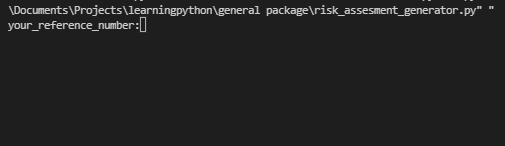
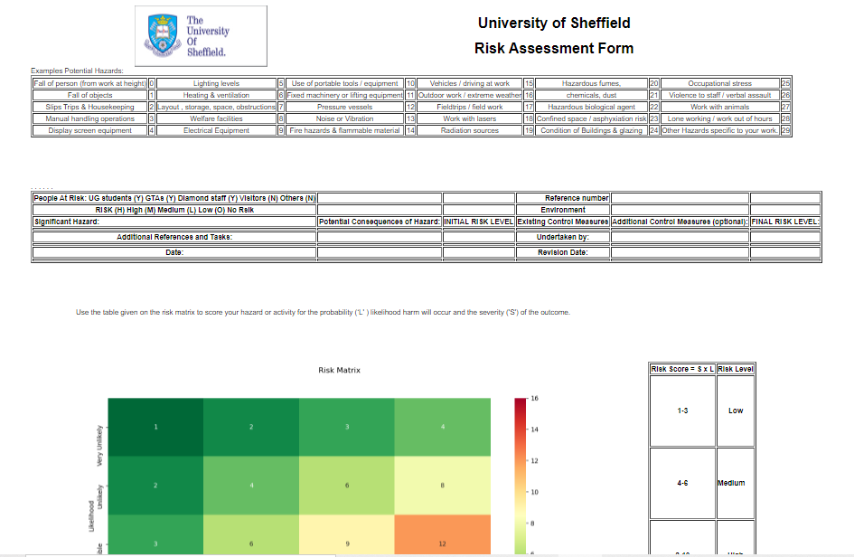

# Risk Assessment Generator

This is the source code of a risk assessment generator application that will generate a risk assessment table as an html file given some inputs.
The user will be able to input the required information from the terminal and download the file as a pdf stored within the directory that the python scipt its launched. 
The terminal will present the input as follows:

whereas the web driver will launch within the local host the risk assesment file as follows:

